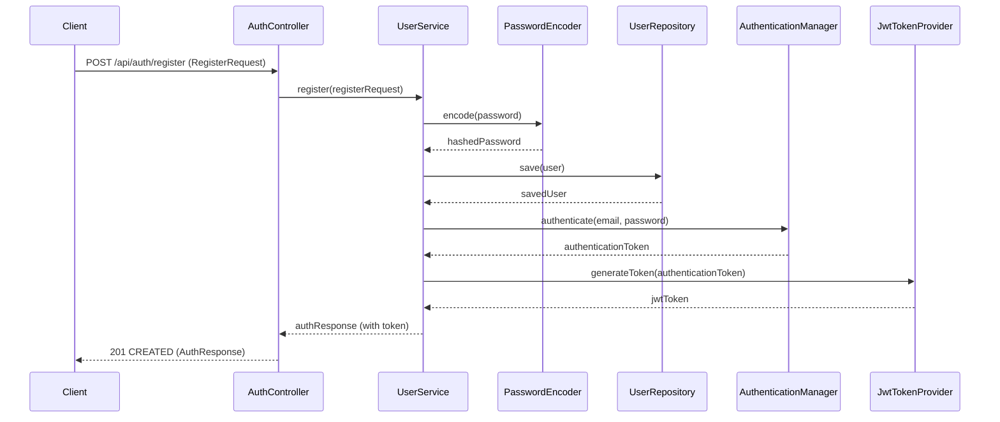
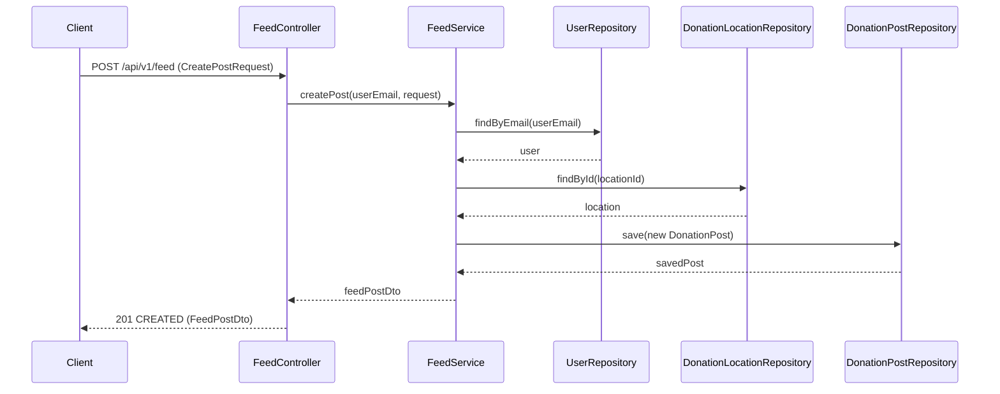
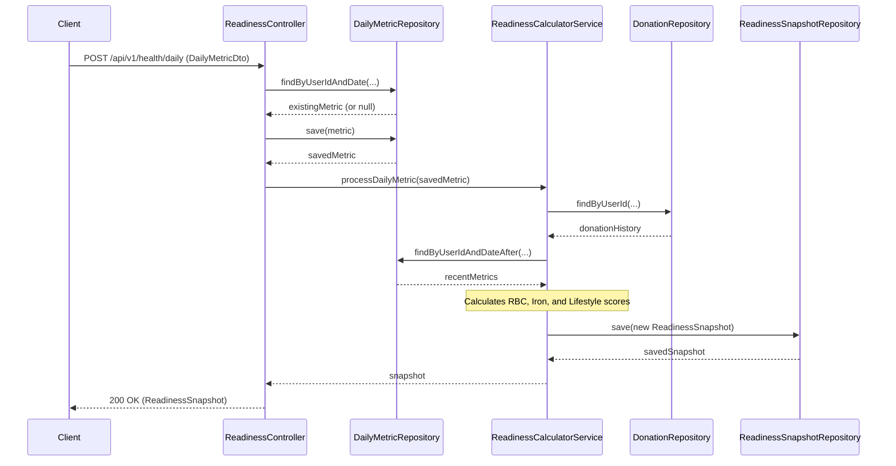
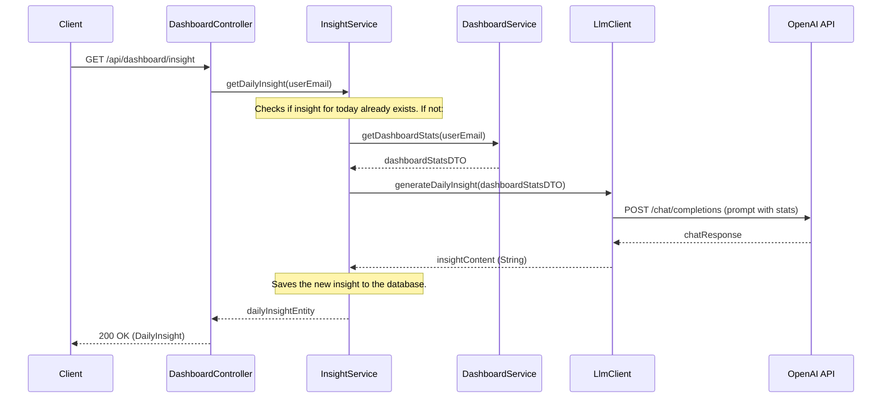

# Backend Logic Documentation

This document provides an overview of the backend logic for the FitSloth/Rakta application. The backend is built using Java and the Spring Boot framework, following a standard layered architecture pattern.

## Architecture Overview

The backend is organized into three main layers:

1.  **Controller Layer (`com.rakta.controller`):** Exposes RESTful API endpoints. This layer is responsible for handling incoming HTTP requests, validating input, and delegating business logic to the Service layer.
2.  **Service Layer (`com.rakta.service`):** Contains the core business logic of the application. Services orchestrate data and operations by interacting with repositories and other services.
3.  **Repository Layer (`com.rakta.repository`):** Manages data persistence. These are Spring Data JPA interfaces that provide an abstraction over the database, allowing for easy CRUD (Create, Read, Update, Delete) operations.

## Core Components

Below is a summary of the primary controllers and services that make up the application.

### Controllers (API Endpoints)

-   `AuthController`: Handles user registration, login, and password reset flows.
-   `CommunityController`: Manages social features like following and unfollowing users.
-   `DashboardController`: Provides aggregated statistics and AI-generated insights for the user's main dashboard.
-   `DonationController`: Manages the logging, retrieval, and export of blood donation records.
-   `FeedController`: Powers the social feed, allowing users to create, view, and interact with donation posts.
-   `HealthController`: Handles basic health logging (e.g., sleep, feeling).
-   `HealthSyncController`: Manages the synchronization of health data from external devices.
-   `IntegrationController`: Manages connections to third-party health services (e.g., Garmin, Apple Health).
-   `IntegrationWebhookController`: Receives incoming webhook events from integrated third-party services.
-   `LocationController`: Provides a list of active donation locations and their statistics.
-   `ReadinessController`: Calculates and retrieves the user's daily "readiness" score based on various health metrics.
-   `UserController`: Manages user profile data (get and update).

### Services (Business Logic)

-   `UserService`: Core logic for user management, including registration, login, and profile updates.
-   `DonationService`: Business logic for handling donation records and calculating eligibility.
-   `FeedService`: Manages the creation and retrieval of social feed posts and likes.
-   `DashboardService`: Aggregates data from multiple sources to build the main dashboard view.
-   `ReadinessCalculatorService`: Contains the complex logic for calculating a user's daily readiness score from various inputs.
-   `InsightService`: Coordinates the generation of daily AI-powered insights for the user.
-   `LlmClient`: A client for interacting with an external Large Language Model (LLM) service (e.g., OpenAI) to generate insights.
-   `CommunityService`: Handles the logic for user-to-user follows and follower management.
-   `HealthIntegrationService`: Manages the connection and data synchronization with external health platforms.
-   `LocationService`: Business logic related to donation locations.
-   `EmailService`: Responsible for sending transactional emails like password resets and welcome messages.
-   `CustomUserDetailsService`: Integrates with Spring Security to load user-specific data for authentication.
-   `IdempotencyService`: Prevents duplicate processing of requests in case of network retries.

## Key Workflow Diagrams

Here are Mermaid sequence diagrams illustrating the flow of some of the application's core workflows.

### 1. User Registration

This diagram shows how a new user is registered and authenticated. The process is handled by the `AuthController` and `UserService`, resulting in a JWT token being returned to the client.

### 2. Create Donation Post

This workflow shows how a user creates a social post about their donation. The `FeedController` receives the request, and the `FeedService` orchestrates the creation of the `DonationPost` entity.

### 3. Calculate Daily Readiness Score

This diagram illustrates the process of submitting daily health metrics and calculating the readiness score. It involves multiple services and repositories to gather context and compute the final score.

### 4. Generate Daily AI Insight

This workflow shows how the system generates a personalized daily insight for the user by calling an external LLM.

